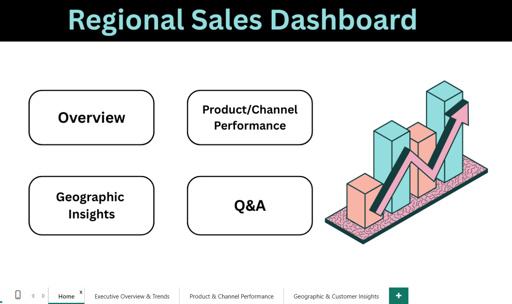
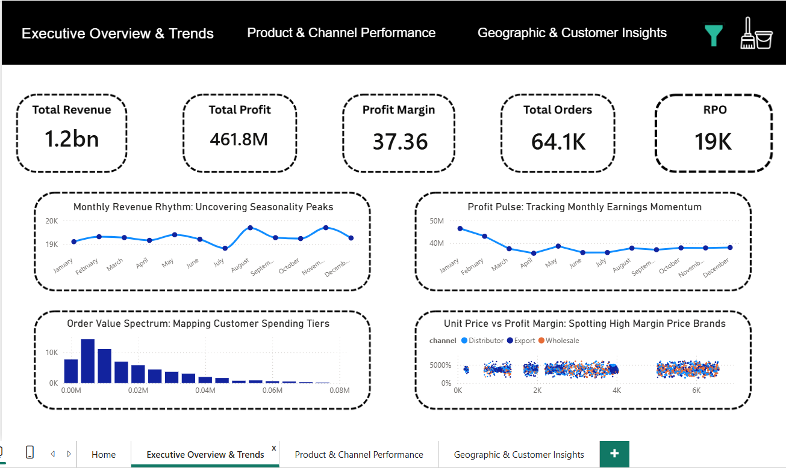
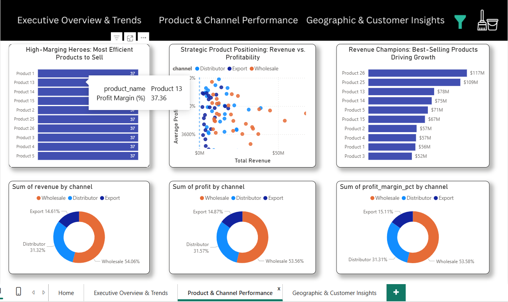
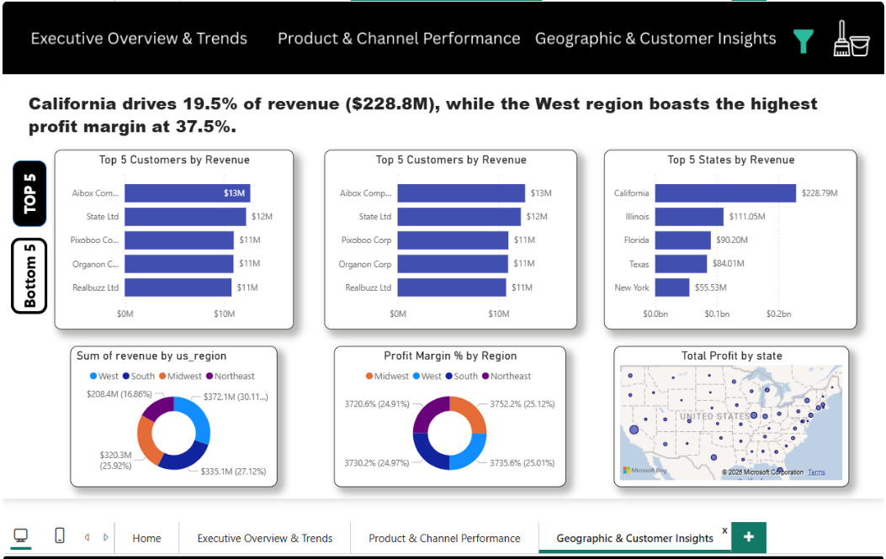
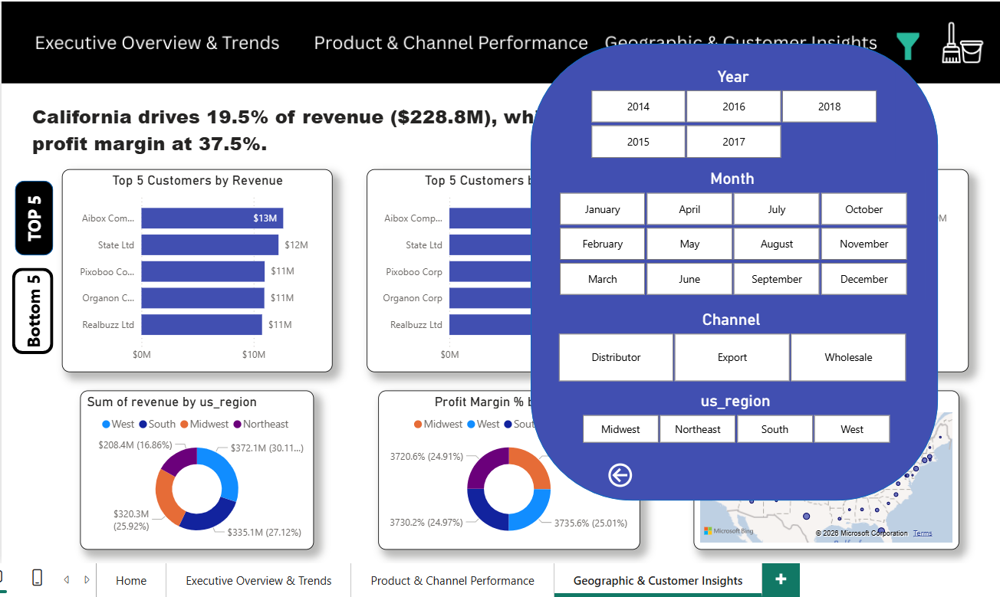

# Regional Sales Analysis Dashboard (Power BI)

## 📊 Project Overview

This is a comprehensive multi-page Power BI dashboard designed to provide actionable insights for an Executive Sales team.

The dashboard focuses on:
- Total Revenue Analysis
- Profit Margin Tracking
- Order Trends
- Regional Performance
- Product Category Insights

---

## 🛠️ Key Features

### ✅ App-like Navigation
Includes a custom landing page and top-bar navigation system to switch between:
- Executive Overview
- Product Performance
- Geographic Insights

### ✅ Custom Pop-out Filter Panel
Built using advanced Bookmark and Selection Pane logic for a clean and interactive user experience.

### ✅ Synced Slicers
Filters are synchronized across all pages for seamless navigation and consistent reporting.

### ✅ Dynamic Top/Bottom Analysis
Interactive buttons allow switching between:
- Top 5 Performers
- Bottom 5 Performers

for:
- Customers
- Products
- States

### ✅ Reset Functionality
A dedicated “Clear All Filters” button restores the dashboard to its default state instantly.

---

## 🧠 Technical Challenges Solved

### Bookmark Conflict Resolution
Managed complex layering in the Selection Pane to ensure the filter panel operates independently from other page interactions.

### Cross-Page Filtering
Implemented Sync Slicers to maintain consistent filtering context across multiple report pages.

### UI/UX Design
Applied professional dashboard design principles including:
- Rounded corners
- Drop shadows
- Consistent color palette
- Clean spacing and alignment

---

## 📈 Insights Highlighted

- California contributes 19.5% of total revenue
- West region has the highest profit margin at 37.5%
- Monthly revenue trends reveal important seasonal sales patterns

---

## 🚀 Tools Used

- Power BI
- Power Query
- DAX
- Data Modeling

---

## 📷 Dashboard Screenshots

### Dashboard 1


---

### Dashboard 2


---

### Dashboard 3


---

### Dashboard 4


---

### Dashboard 5


---

## 🚀 How to Run

1. Clone this repository

```bash
git clone https://github.com/EeshaChowdhary/regional_sales_analysis.git
```

2. Open the project folder

3. Run the Jupyter Notebook:

```bash
jupyter notebook
```

4. Open:

- `regional_sales_analysis.ipynb`

OR run the Python script:

```bash
python regional_sales_analysis.py
```